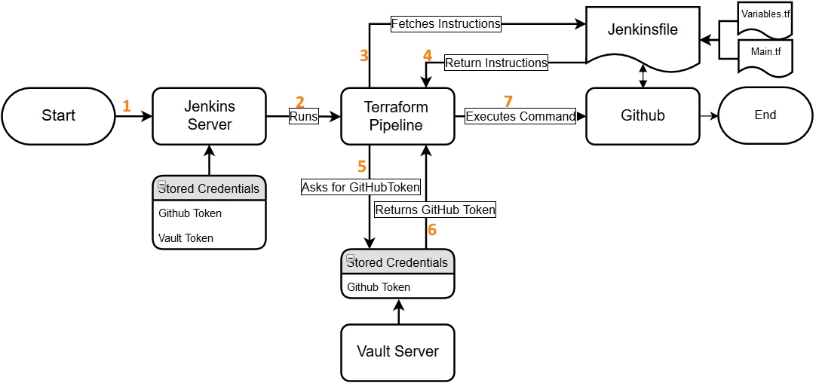

# GitHubTF-Pipeline

This repository provides a means by which to integrate a GitOps workflow utilizing Terraform and Jenkins to streamline the operational processes of managing GiHub based repositories and teams.

Utilizing the open source automation server ‘Jenkins’ a pipeline has been created that integrates the use of Terraform, GitHub and Vault. The use of Webhooks allows for any PR or Master merge to automatically result in the initiation of the process. 

The completed pipeline will execute the following actions
The Jenkins server is launched (1) and stores GitHub and a Multibranch Pipeline is set up (2) that fetches a set of instructions stored in a Jenkinsfile (3) which we have placed on GitHub itself. Using a Webhook, the pipeline retrieved the information from the targeted repository (4) 
In order to execute the commands it finds, the pipeline will have to provide GitHub with Valid Credentials. These can unfortunatly not be those stored directly in Jenkins and used for the webhook, a way of doing this is still being explored. 
The pipeline uses stored Vault Credentials (5) to fetch GitHub credentials (6) which are then used to apply the desired changes to GitHub (6). In our case we have included a series of Terraform instructions that will be executed.   
 

